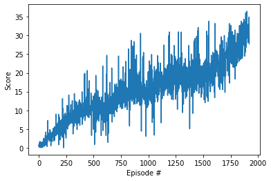

# Implementation 

for this project we use a DDPG implementation, the implementation is based on 
the implementation provided by Udacity with just few adjustments to be able to train
in parallel 

the architecture of the project is the following 

# Actor
- Hidden: [input, 256]
- Hidden: [256, 128]
- Output: [128, 4]

# Critic
- Hidden: [input, 256]
- Hidden: [256 + action_size, 128]
- Output: [128, 1]

# Hyperparameters
  Learning rate critic 1e-4
  Learning rate actor 1e-4
  batch size 128
  Gamma 0.99
  TAU = 1e-3

# result
  the actual model took around 96 episodes at trained at 20 parallel agents
  what gives a total 1920 games played beffore solving the environment

  

  
# future work
  for a future work would be grate to implement a D4PG, A3C to compare the results and how fast it learns the environmen, A3C to compare the results and how fast it learns the environment
  alse apply the same algorithms on the crawler environment

